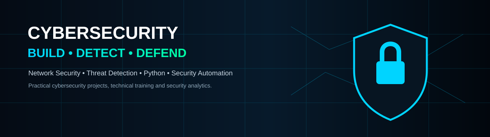
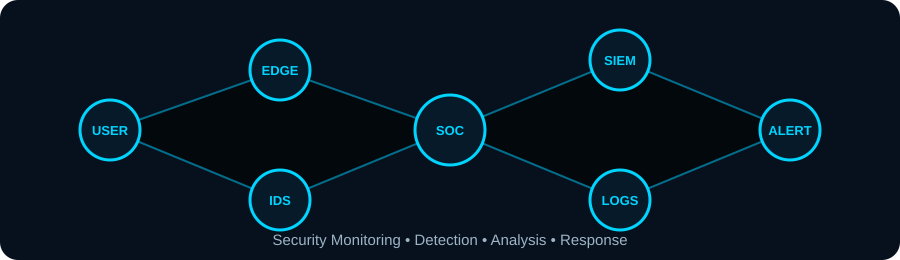

# 👋 Hi, I'm Samuel Olutusin

<b>Cybersecurity Professional • Network Security Specialist • IT Instructor • Python Developer</b>

I build practical security projects, teach job-ready technical skills, and explore better ways to detect, analyze and respond to cyber threats.

---

## 🛡️ About Me

I am an IT Instructor and cybersecurity professional with experience across **networking, cybersecurity, ethical hacking, penetration testing and security operations**.

My approach is strongly practical: I turn security concepts into **hands-on labs, portfolio projects, realistic scenarios and useful technical resources**.

### Core Focus

- 🛡️ Cybersecurity & Network Security
- 🔎 Threat Detection & Security Monitoring
- 🌐 Networking, TCP/IP, VLANs, Routing & Switching
- 🧪 Ethical Hacking & Penetration Testing
- 🚨 Incident Response & SOC Operations
- 📊 Security Analytics & GRC Fundamentals
- 🐍 Python, Bash & Security Automation
- 👨‍🏫 Cybersecurity & IT Training

## 🧰 Security Tools & Technologies

---

## 🚀 Featured Cybersecurity Projects

### 🔐 Real-Time Network Intrusion Detection System
**Python • Machine Learning • Random Forest • Scapy • Streamlit**

A defensive security project for detecting potentially malicious network activity through network-flow analysis and machine-learning classification.

**Highlights**
- Network-flow preprocessing and feature engineering
- Random Forest intrusion classification
- Confusion-matrix and classification evaluation
- Feature-importance analysis
- Passive monitoring and alert generation
- Streamlit security dashboard
- Structured security reporting

👉 **[View Project](https://github.com/samolutusin/real-time-network-intrusion-detection-system)**

### 🎣 Phishing Attack Detection System
A Python-based defensive project focused on identifying potentially malicious or phishing URLs using feature analysis and machine-learning techniques.

### 🌐 Network Security & Traffic Analysis Labs
Hands-on labs involving network discovery, packet analysis, vulnerability assessment, troubleshooting and security monitoring using tools such as Nmap, Wireshark, GNS3 and EVE-NG.

### 🛡️ Security Operations & Threat Detection Labs
Practical exercises around log analysis, threat detection, incident response, SIEM concepts and defensive security workflows.

---

## 📊 Security Mindset

> **Security is not only about finding vulnerabilities. It is about understanding risk, detecting threats, responding effectively and continuously improving defenses.**

---

## 🏆 Certifications & Credentials

My professional learning and digital credentials include cybersecurity, ethical hacking, networking and security operations training.

- Cisco CyberOps Associate
- Cisco Ethical Hacker
- CompTIA Network+ training
- CompTIA Security+ (SY0-701) training
- Additional verified credentials available through Credly

👉 **[View my Credly profile](https://www.credly.com/)**

---

## 👨‍🏫 What I Do

I help students and aspiring cybersecurity professionals move from **theory → hands-on capability → portfolio evidence**.

I create and teach practical learning experiences around:

**Networking • Cybersecurity • Ethical Hacking • SOC Operations • Incident Response • Network Security • GRC • Red Team/Blue Team • Cybersecurity Portfolio Development**

---

## 📚 Currently Building

- 🔎 Threat detection and security analytics projects
- 🐍 Python security automation
- 🌐 Network security labs
- 🛡️ SOC and incident-response exercises
- 🤖 AI-assisted cybersecurity workflows
- 👨‍🏫 Practical cybersecurity training resources

---

## 🤝 Let's Connect

**GitHub:** https://github.com/samolutusin  
**LinkedIn:** Use the LinkedIn URL already attached to your current profile  
**Credly:** https://www.credly.com/

<i>Building practical skills. Developing practical defenses. Strengthening cybersecurity.</i>

